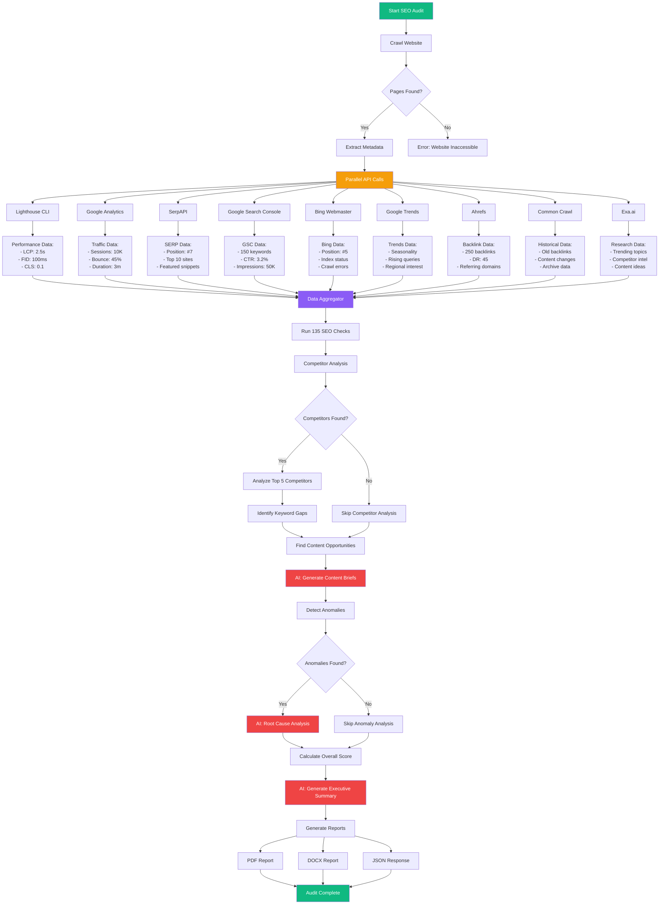
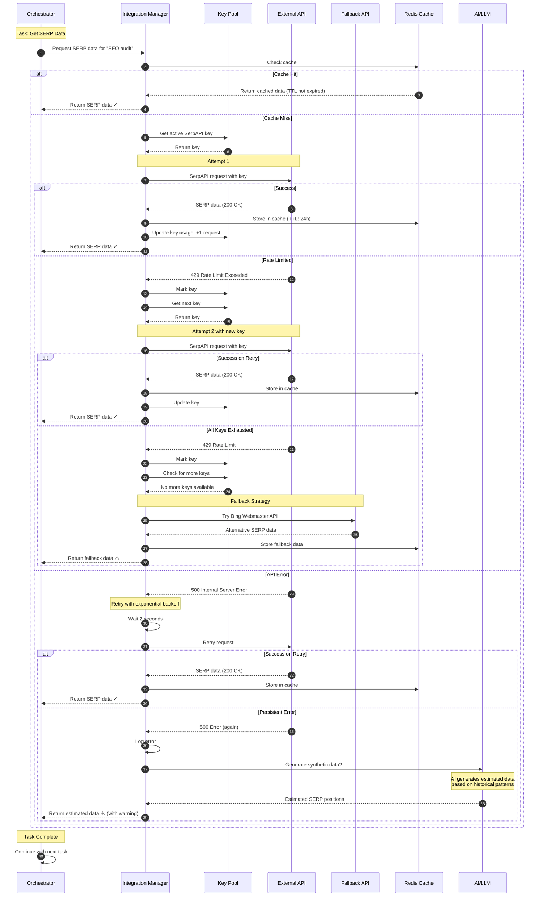
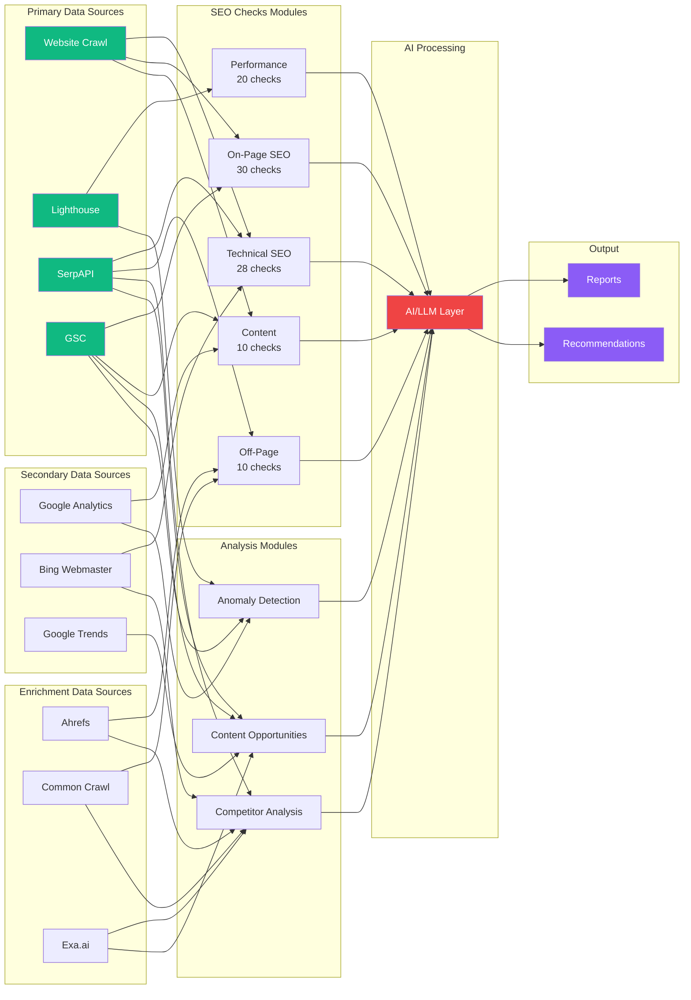
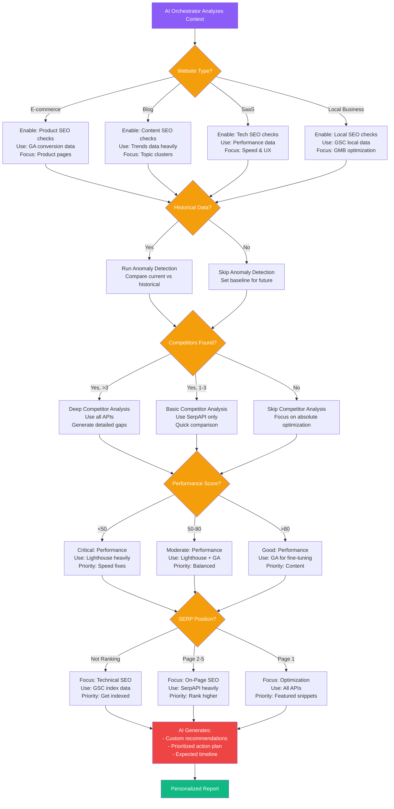
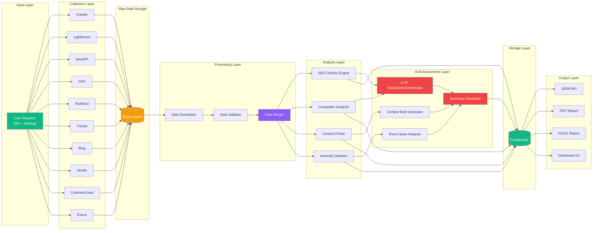
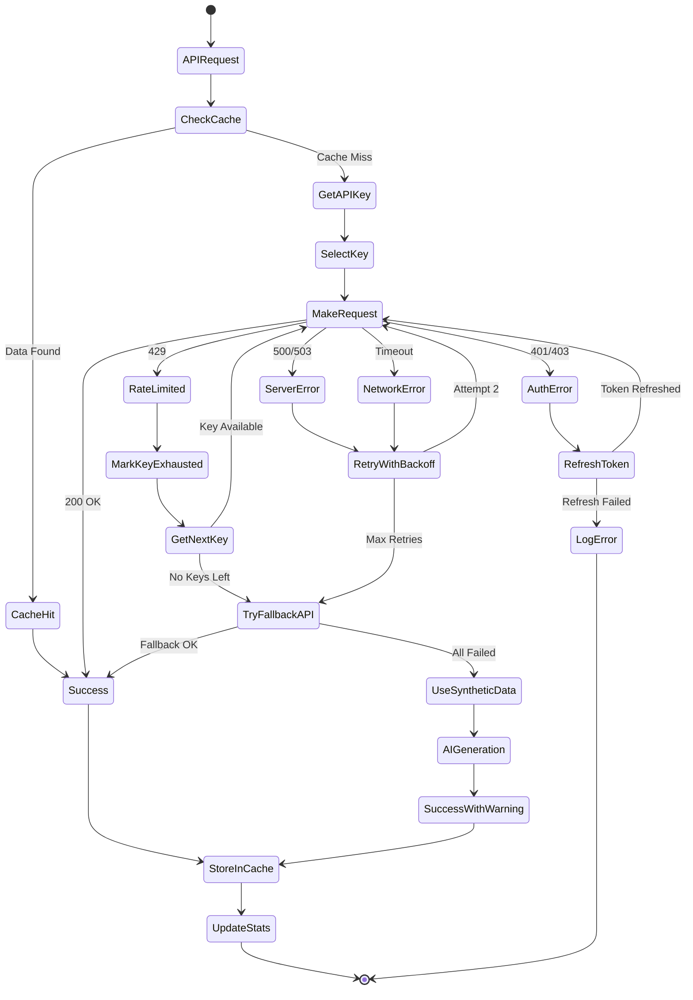

# 🤖 AI ORCHESTRATOR & API INTEGRATION FLOW
## Detailed Architecture: How AI Uses All 9 APIs to Generate Reports

---

## 1. COMPLETE AI ORCHESTRATOR ARCHITECTURE

```mermaid
graph TB
    subgraph "User Layer"
        U[User Creates Audit Request]
    end
    
    subgraph "API Gateway"
        API[FastAPI Backend]
        API --> AQ[Audit Queue]
    end
    
    subgraph "AI Orchestrator Core"
        ORCH[Main Orchestrator Agent]
        ORCH --> CM[Context Manager]
        ORCH --> TM[Task Manager]
        ORCH --> DM[Decision Manager]
        
        TM --> T1[Task: Crawl Website]
        TM --> T2[Task: Performance Analysis]
        TM --> T3[Task: SERP Analysis]
        TM --> T4[Task: Competitor Research]
        TM --> T5[Task: Content Opportunities]
        TM --> T6[Task: Anomaly Detection]
        TM --> T7[Task: Report Generation]
    end
    
    subgraph "Sub-Agent Layer"
        SA1[Crawler Agent]
        SA2[Performance Agent]
        SA3[SERP Agent]
        SA4[Competitor Agent]
        SA5[Content Agent]
        SA6[Anomaly Agent]
        SA7[Report Agent]
    end
    
    subgraph "Integration Manager"
        IM[Integration Manager]
        KP[Key Pool Manager]
        RL[Rate Limiter]
        CH[Cache Handler]
        FO[Failover Logic]
    end
    
    subgraph "External APIs - Group 1: Performance"
        LC[Lighthouse CLI]
        GA[Google Analytics]
    end
    
    subgraph "External APIs - Group 2: SEO Data"
        SERP[SerpAPI]
        GSC[Google Search Console]
        BING[Bing Webmaster]
    end
    
    subgraph "External APIs - Group 3: Research"
        EXA[Exa.ai]
        TRENDS[Google Trends]
        AH[Ahrefs]
        CC[Common Crawl]
    end
    
    subgraph "AI/LLM Layer"
        LLM[Active LLM Provider]
        LLM --> GROQ[Groq]
        LLM --> OAI[OpenAI]
        LLM --> ANT[Anthropic]
    end
    
    subgraph "Data Storage"
        DB[(PostgreSQL)]
        REDIS[(Redis Cache)]
    end
    
    subgraph "Report Output"
        PDF[PDF Report]
        DOCX[DOCX Report]
        JSON[JSON API Response]
    end
    
    U --> API
    AQ --> ORCH
    
    ORCH --> SA1
    ORCH --> SA2
    ORCH --> SA3
    ORCH --> SA4
    ORCH --> SA5
    ORCH --> SA6
    ORCH --> SA7
    
    SA1 --> IM
    SA2 --> IM
    SA3 --> IM
    SA4 --> IM
    SA5 --> IM
    SA6 --> IM
    
    IM --> KP
    IM --> RL
    IM --> CH
    IM --> FO
    
    IM --> LC
    IM --> GA
    IM --> SERP
    IM --> GSC
    IM --> BING
    IM --> EXA
    IM --> TRENDS
    IM --> AH
    IM --> CC
    
    SA5 --> LLM
    SA6 --> LLM
    SA7 --> LLM
    
    CH --> REDIS
    
    SA1 --> DB
    SA2 --> DB
    SA3 --> DB
    SA4 --> DB
    SA5 --> DB
    SA6 --> DB
    SA7 --> DB
    
    SA7 --> PDF
    SA7 --> DOCX
    SA7 --> JSON
    
    style ORCH fill:#8B5CF6,color:#fff,stroke:#7C3AED,stroke-width:3px
    style IM fill:#F59E0B,color:#fff
    style LLM fill:#EF4444,color:#fff
    style DB fill:#10B981,color:#fff
    style REDIS fill:#10B981,color:#fff
```

---

## 2. STEP-BY-STEP REPORT GENERATION FLOW

```mermaid
sequenceDiagram
    autonumber
    participant User
    participant API as FastAPI
    participant Orch as Main Orchestrator
    participant CA as Crawler Agent
    participant PA as Performance Agent
    participant SA as SERP Agent
    participant CompA as Competitor Agent
    participant ContA as Content Agent
    participant AA as Anomaly Agent
    participant RA as Report Agent
    participant IM as Integration Manager
    participant APIs as External APIs (9)
    participant LLM as AI/LLM
    participant DB as Database
    participant Cache as Redis Cache
    
    User->>API: POST /audits {url: "example.com"}
    API->>DB: Create Audit (status: pending)
    API->>Orch: Start Audit Process
    
    Note over Orch: Phase 1: Context Setup
    Orch->>Orch: Load configuration
    Orch->>Orch: Initialize task queue
    Orch->>DB: Update status: crawling
    
    Note over Orch,CA: Phase 2: Website Crawling
    Orch->>CA: Task: Crawl website
    CA->>IM: Request: Fetch website
    IM->>Cache: Check cache
    alt Cache Hit
        Cache-->>CA: Return cached HTML
    else Cache Miss
        IM->>APIs: HTTP Request (no API key)
        APIs-->>IM: Website HTML
        IM->>Cache: Store in cache (TTL: 1hr)
        IM-->>CA: Return HTML
    end
    CA->>CA: Parse HTML, extract metadata
    CA->>CA: Extract 40+ data points
    CA->>DB: Store crawled data
    CA-->>Orch: Crawling complete ✓
    
    Note over Orch,PA: Phase 3: Performance Analysis
    Orch->>DB: Update status: analyzing
    Orch->>PA: Task: Analyze performance
    PA->>IM: Request: Run Lighthouse
    IM->>IM: Get API key (Lighthouse CLI local)
    IM->>APIs: Execute Lighthouse CLI
    APIs-->>IM: Performance scores (LCP, FID, CLS)
    IM-->>PA: Lighthouse results
    PA->>IM: Request: Get Google Analytics
    IM->>IM: Select key from pool
    IM->>APIs: GA API request
    alt Success
        APIs-->>IM: Traffic data
        IM->>DB: Update key usage stats
    else Rate Limit
        APIs-->>IM: 429 Error
        IM->>IM: Mark key exhausted
        IM->>IM: Get next key from pool
        IM->>APIs: Retry GA API
        APIs-->>IM: Traffic data
    end
    IM-->>PA: Analytics data
    PA->>PA: Calculate performance score
    PA->>DB: Store performance results
    PA-->>Orch: Performance analysis complete ✓
    
    Note over Orch,SA: Phase 4: SERP & Keyword Analysis
    Orch->>SA: Task: Analyze SERP
    SA->>IM: Request: Get SERP data
    IM->>IM: Select SerpAPI key
    IM->>APIs: SerpAPI request (target keywords)
    APIs-->>IM: SERP rankings + competitors
    IM->>Cache: Cache SERP data (TTL: 24hrs)
    IM-->>SA: SERP results
    
    SA->>IM: Request: Get GSC data
    IM->>IM: Select GSC OAuth token
    IM->>APIs: GSC API request
    APIs-->>IM: Keywords, CTR, impressions
    IM-->>SA: GSC data
    
    SA->>IM: Request: Get Bing data
    IM->>IM: Select Bing key
    IM->>APIs: Bing Webmaster API
    APIs-->>IM: Bing rankings
    IM-->>SA: Bing data
    
    SA->>SA: Merge SERP data from all sources
    SA->>DB: Store SERP analysis
    SA-->>Orch: SERP analysis complete ✓
    
    Note over Orch,CompA: Phase 5: Competitor Analysis
    Orch->>CompA: Task: Analyze competitors
    CompA->>CompA: Extract competitor URLs from SERP
    
    loop For each competitor (top 5)
        CompA->>IM: Request: Crawl competitor
        IM->>APIs: HTTP Request
        APIs-->>IM: Competitor HTML
        IM-->>CompA: Competitor data
        
        CompA->>IM: Request: Get Ahrefs data
        IM->>IM: Select Ahrefs key
        IM->>APIs: Ahrefs API (backlinks)
        APIs-->>IM: Backlink profile
        IM-->>CompA: Ahrefs data
        
        CompA->>IM: Request: Common Crawl
        IM->>APIs: Common Crawl CDX API
        APIs-->>IM: Historical data
        IM-->>CompA: Historical backlinks
        
        CompA->>CompA: Analyze competitor strengths
    end
    
    CompA->>CompA: Compare with target site
    CompA->>CompA: Identify keyword gaps
    CompA->>DB: Store competitor analysis
    CompA-->>Orch: Competitor analysis complete ✓
    
    Note over Orch,ContA: Phase 6: Content Opportunities (AI-Powered)
    Orch->>ContA: Task: Find content opportunities
    ContA->>ContA: Load competitor keyword gaps
    
    ContA->>IM: Request: Get Google Trends
    IM->>APIs: Trends API (keyword seasonality)
    APIs-->>IM: Trend data
    IM-->>ContA: Trends data
    
    ContA->>IM: Request: Exa.ai research
    IM->>IM: Select Exa.ai key
    IM->>APIs: Exa.ai search (trending topics)
    APIs-->>IM: Research insights
    IM-->>ContA: Exa.ai data
    
    ContA->>ContA: Score opportunities (difficulty, volume)
    ContA->>ContA: Prioritize quick wins
    
    ContA->>LLM: Generate content briefs
    Note over ContA,LLM: AI generates:<br/>- Title suggestions<br/>- Outline<br/>- Optimization tips
    LLM-->>ContA: AI-generated briefs
    
    ContA->>DB: Store content opportunities
    ContA-->>Orch: Content opportunities complete ✓
    
    Note over Orch,AA: Phase 7: Anomaly Detection
    Orch->>AA: Task: Detect anomalies
    AA->>DB: Load historical audit data
    AA->>AA: Calculate baseline (avg, stddev)
    
    AA->>AA: Compare current vs historical
    AA->>AA: Check traffic deviation
    AA->>AA: Check ranking changes
    AA->>AA: Check performance degradation
    
    alt Anomaly Detected (>2σ)
        AA->>LLM: Analyze root cause
        LLM-->>AA: AI analysis + recommendations
        AA->>AA: Classify severity (critical/high/medium)
        AA->>DB: Store anomaly
        AA->>API: Send alert notification
    else No Anomalies
        AA->>AA: Log as normal
    end
    
    AA-->>Orch: Anomaly detection complete ✓
    
    Note over Orch,RA: Phase 8: Report Generation
    Orch->>DB: Update status: generating_report
    Orch->>RA: Task: Generate final report
    RA->>DB: Load all audit data
    RA->>DB: Load check results
    RA->>DB: Load competitors
    RA->>DB: Load opportunities
    RA->>DB: Load anomalies
    
    RA->>LLM: Generate executive summary
    Note over RA,LLM: AI creates:<br/>- Executive summary<br/>- Key insights<br/>- Priority actions<br/>- Expected impact
    LLM-->>RA: AI-generated summary
    
    RA->>RA: Build PDF report
    RA->>RA: Build DOCX report
    RA->>DB: Save report paths
    
    RA-->>Orch: Report generation complete ✓
    
    Note over Orch: Phase 9: Finalization
    Orch->>DB: Update status: completed
    Orch->>DB: Calculate overall score
    Orch-->>API: Audit complete
    API-->>User: Return audit results + reports
```



---

## 3. MULTI-AGENT COLLABORATION SYSTEM

```mermaid
graph TD
    subgraph "Orchestrator Brain"
        O[Main Orchestrator]
        O --> TP[Task Planner]
        O --> PM[Priority Manager]
        O --> CM[Coordination Manager]
    end
    
    subgraph "Specialized Agents"
        A1[Crawler Agent]
        A2[Performance Agent]
        A3[SERP Agent]
        A4[Competitor Agent]
        A5[Content Agent]
        A6[Anomaly Agent]
        A7[Report Agent]
        A8[Research Agent]
    end
    
    subgraph "Agent Capabilities"
        A1 --> C1[Extract HTML<br/>Parse Metadata<br/>40+ Data Points]
        A2 --> C2[Lighthouse<br/>Core Web Vitals<br/>GA Analytics]
        A3 --> C3[SERP Rankings<br/>GSC Keywords<br/>Bing Data]
        A4 --> C4[Identify Competitors<br/>Backlink Analysis<br/>Gap Analysis]
        A5 --> C5[Find Opportunities<br/>Trend Analysis<br/>AI Content Briefs]
        A6 --> C6[Statistical Analysis<br/>Pattern Detection<br/>Root Cause AI]
        A7 --> C7[PDF Generation<br/>DOCX Generation<br/>AI Summary]
        A8 --> C8[Exa.ai Research<br/>Industry Trends<br/>Topic Discovery]
    end
    
    subgraph "Shared Resources"
        SR1[Context Memory]
        SR2[Task Queue]
        SR3[Results Cache]
    end
    
    O --> A1
    O --> A2
    O --> A3
    O --> A4
    O --> A5
    O --> A6
    O --> A7
    O --> A8
    
    A1 --> SR1
    A2 --> SR1
    A3 --> SR1
    A4 --> SR1
    A5 --> SR1
    A6 --> SR1
    A7 --> SR1
    A8 --> SR1
    
    A1 --> SR2
    A2 --> SR2
    A3 --> SR2
    A4 --> SR2
    A5 --> SR2
    A6 --> SR2
    A7 --> SR2
    A8 --> SR2
    
    A1 --> SR3
    A2 --> SR3
    A3 --> SR3
    A4 --> SR3
    A5 --> SR3
    A6 --> SR3
    
    A4 -.->|Uses data from| A3
    A5 -.->|Uses data from| A3
    A5 -.->|Uses data from| A4
    A6 -.->|Uses data from| A2
    A6 -.->|Uses data from| A3
    A7 -.->|Uses data from| A1
    A7 -.->|Uses data from| A2
    A7 -.->|Uses data from| A3
    A7 -.->|Uses data from| A4
    A7 -.->|Uses data from| A5
    A7 -.->|Uses data from| A6
    
    style O fill:#8B5CF6,color:#fff
    style A5 fill:#F59E0B,color:#fff
    style A6 fill:#EF4444,color:#fff
    style A7 fill:#10B981,color:#fff
```



---

## 4. API DATA AGGREGATION & DECISION FLOW



---

## 5. REAL-TIME ORCHESTRATION WITH RETRY & FAILOVER



---

## 6. API INTERACTION MATRIX



---

## 7. CONTEXT FLOW BETWEEN AGENTS

```mermaid
flowchart TB
    START[Audit Started] --> INIT[Initialize Context]
    
    INIT --> CTX1[Context Object:<br/>- Website URL<br/>- User preferences<br/>- Historical data]
    
    CTX1 --> A1[Crawler Agent]
    A1 --> CTX2[+ Crawled pages<br/>+ Metadata<br/>+ Page structure]
    
    CTX2 --> A2[Performance Agent]
    A2 --> CTX3[+ Lighthouse scores<br/>+ Core Web Vitals<br/>+ GA traffic data]
    
    CTX3 --> A3[SERP Agent]
    A3 --> CTX4[+ Current rankings<br/>+ Competitor URLs<br/>+ Keywords]
    
    CTX4 --> A4[Competitor Agent]
    A4 --> CTX5[+ Competitor analysis<br/>+ Keyword gaps<br/>+ Backlink comparison]
    
    CTX5 --> A5[Content Agent]
    A5 --> CTX6[+ Content opportunities<br/>+ AI briefs<br/>+ Trend data]
    
    CTX6 --> A6[Anomaly Agent]
    A6 --> CTX7[+ Detected anomalies<br/>+ Severity levels<br/>+ Root causes]
    
    CTX7 --> A7[Report Agent]
    A7 --> FINAL[Final Report:<br/>- Executive summary<br/>- All check results<br/>- Competitors<br/>- Opportunities<br/>- Anomalies<br/>- AI insights]
    
    style START fill:#10B981,color:#fff
    style INIT fill:#F59E0B,color:#fff
    style CTX1 fill:#E5E7EB
    style CTX2 fill:#E5E7EB
    style CTX3 fill:#E5E7EB
    style CTX4 fill:#E5E7EB
    style CTX5 fill:#E5E7EB
    style CTX6 fill:#E5E7EB
    style CTX7 fill:#E5E7EB
    style FINAL fill:#8B5CF6,color:#fff
```



---

## 8. AI-POWERED DECISION TREE



---

## 9. COMPLETE DATA PIPELINE



---

## 10. ERROR HANDLING & RECOVERY FLOW



---

## 📊 KEY TAKEAWAYS

### **How AI Orchestrator Works:**
1. **Task Planning**: Breaks audit into 8 sequential tasks
2. **Agent Delegation**: Assigns tasks to specialized agents
3. **Context Management**: Passes enriched context between agents
4. **Decision Making**: Adapts strategy based on website type & data
5. **AI Enhancement**: Uses LLM for content briefs, summaries, root cause analysis

### **How 9 APIs are Used:**
1. **Lighthouse CLI** → Performance Agent → Real scores
2. **SerpAPI** → SERP Agent → Rankings & competitors
3. **Google Search Console** → SERP Agent → Keyword data
4. **Google Analytics** → Performance Agent → Traffic insights
5. **Google Trends** → Content Agent → Seasonality
6. **Bing Webmaster** → SERP Agent → Additional rankings
7. **Ahrefs** → Competitor Agent → Backlinks
8. **Common Crawl** → Competitor Agent → Historical data
9. **Exa.ai** → Research Agent → Industry trends

### **Agent Collaboration:**
- **Sequential**: Crawler → Performance → SERP → Competitor → Content → Anomaly → Report
- **Parallel**: APIs called simultaneously within each phase
- **Shared Context**: All agents read/write to central context object
- **Data Dependencies**: Later agents use data from earlier agents

### **Error Handling:**
- ✅ API key rotation on rate limits
- ✅ Exponential backoff on errors
- ✅ Fallback APIs when primary fails
- ✅ AI-generated synthetic data as last resort
- ✅ Cached data to reduce API calls

---

**This architecture ensures reliable, intelligent, and comprehensive SEO audits! 🚀**
