# 🏗️ ARCHITECTURE DIAGRAMS - SEO Audit Platform

Complete system architecture visualization using Mermaid diagrams.

---

## 1. SYSTEM ARCHITECTURE OVERVIEW

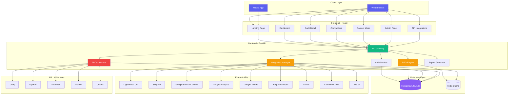

---

## 2. DATABASE SCHEMA

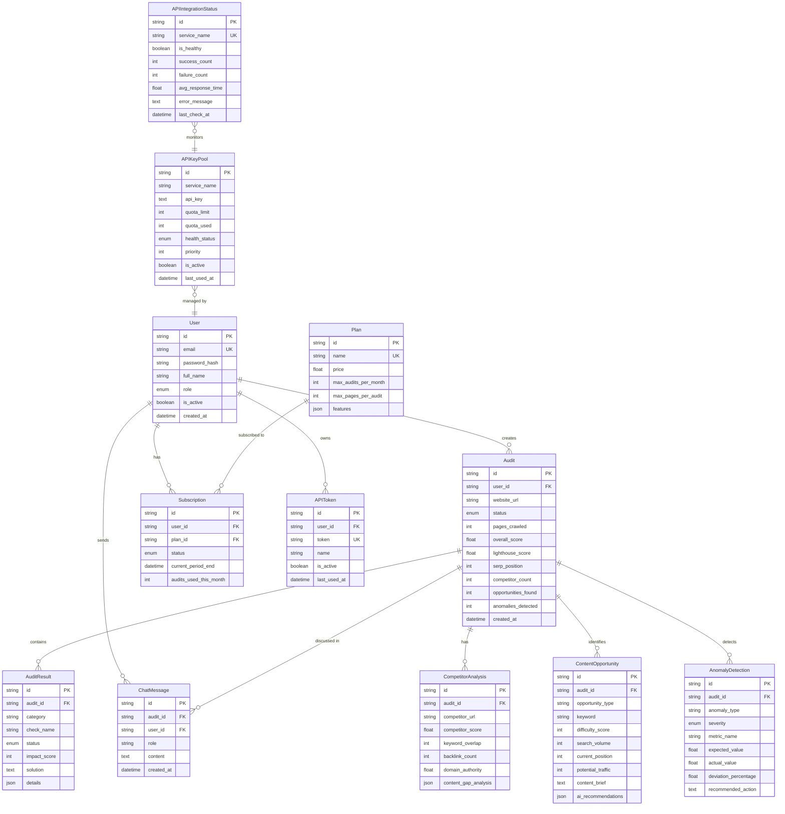

---

## 3. API INTEGRATION FLOW

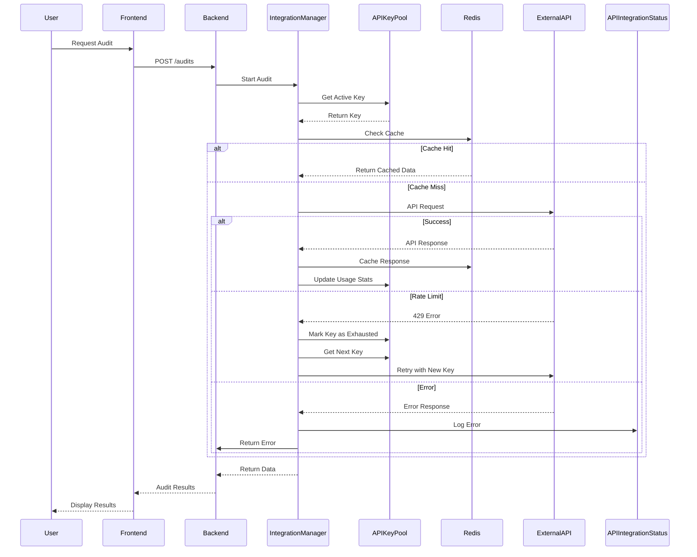

---

## 4. SEO AUDIT PROCESSING FLOW

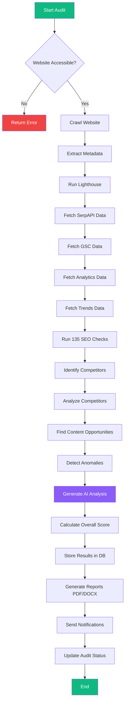

---

## 5. USER FLOW DIAGRAM

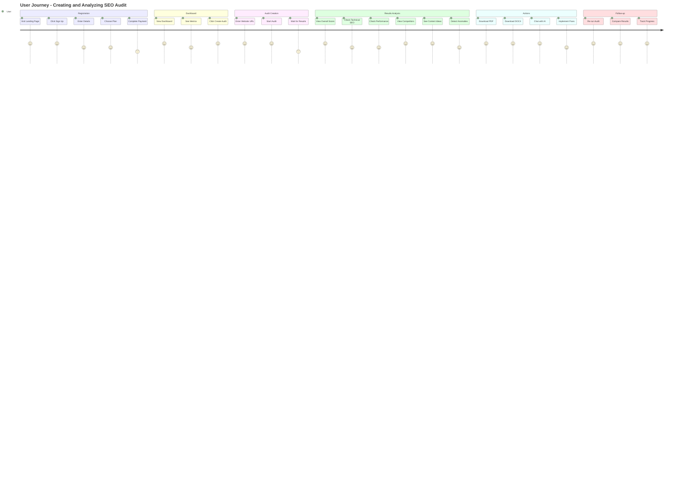

---

## 6. ADMIN PANEL STRUCTURE

```mermaid
graph TD
    A[Admin Dashboard] --> B[Overview Tab]
    A --> C[Users Tab]
    A --> D[Plans Tab]
    A --> E[Themes Tab]
    A --> F[LLM Settings Tab]
    A --> G[Environment Keys Tab]
    A --> H[API Key Pools Tab]
    A --> I[Integrations Tab]
    A --> J[Audits Tab]
    A --> K[Content Opportunities Tab]
    A --> L[Anomalies Tab]
    A --> M[Analytics Tab]
    
    B --> B1[Key Metrics]
    B --> B2[Recent Activity]
    B --> B3[System Health]
    
    C --> C1[User List]
    C --> C2[Add User]
    C --> C3[Edit User]
    C --> C4[Delete User]
    
    D --> D1[Plan List]
    D --> D2[Create Plan]
    D --> D3[Edit Plan]
    D --> D4[Stripe Price IDs]
    
    E --> E1[Theme List]
    E --> E2[Create Theme]
    E --> E3[Edit Colors]
    E --> E4[Activate Theme]
    
    F --> F1[LLM List]
    F --> F2[Add LLM]
    F --> F3[Configure LLM]
    F --> F4[Activate LLM]
    
    G --> G1[Environment Keys List]
    G --> G2[Add Key]
    G --> G3[Edit Key]
    G --> G4[Toggle Active]
    
    H --> H1[API Key Pools by Service]
    H --> H2[Add API Key]
    H --> H3[Test Connection]
    H --> H4[View Usage Stats]
    H --> H5[Key Rotation Settings]
    
    I --> I1[Integration Health Status]
    I --> I2[Uptime Monitoring]
    I --> I3[Error Logs]
    I --> I4[Usage Statistics]
    I --> I5[Cost Tracking]
    
    J --> J1[All Audits List]
    J --> J2[Filter by User]
    J --> J3[Filter by Status]
    J --> J4[Bulk Actions]
    
    K --> K1[Global Opportunities]
    K --> K2[Trend Analysis]
    K --> K3[AI Usage Stats]
    
    L --> L1[System Anomalies]
    L --> L2[Alert Configuration]
    L --> L3[Resolution Tracking]
    
    M --> M1[User Activity]
    M --> M2[Feature Usage]
    M --> M3[Cost Analytics]
    M --> M4[Performance Metrics]
    
    style A fill:#5B60F0,color:#fff
    style H fill:#F59E0B,color:#fff
    style I fill:#F59E0B,color:#fff
    style K fill:#10B981,color:#fff
    style L fill:#EF4444,color:#fff
```

---

## 7. COMPONENT HIERARCHY (Frontend)

```mermaid
graph TD
    A[App.js] --> B[Router]
    
    B --> C[Public Routes]
    B --> D[Protected Routes]
    B --> E[Admin Routes]
    
    C --> C1[Landing]
    C --> C2[Login]
    C --> C3[Register]
    C --> C4[Plans]
    
    D --> D1[TopNavigation]
    D --> D2[Dashboard]
    D --> D3[AuditDetail]
    D --> D4[Competitors]
    D --> D5[ContentIdeas]
    D --> D6[Integrations]
    D --> D7[Settings]
    D --> D8[APITokens]
    D --> D9[Chat]
    
    E --> E1[AdminDashboard]
    
    D1 --> D1A[Logo]
    D1 --> D1B[NavLinks]
    D1 --> D1C[SearchBar]
    D1 --> D1D[NotificationBell]
    D1 --> D1E[UserDropdown]
    
    D2 --> D2A[MetricCards]
    D2 --> D2B[TabNavigation]
    D2 --> D2C[AuditList]
    D2 --> D2D[Charts]
    
    D2A --> D2A1[MetricCard - Total Audits]
    D2A --> D2A2[MetricCard - Avg Score]
    D2A --> D2A3[MetricCard - Issues]
    D2A --> D2A4[MetricCard - Opportunities]
    
    D3 --> D3A[AuditHeader]
    D3 --> D3B[ScoreCards]
    D3 --> D3C[TabNavigation]
    D3 --> D3D[CheckResults]
    D3 --> D3E[CompetitorSection]
    D3 --> D3F[OpportunitiesSection]
    
    D3B --> D3B1[TechnicalSEOCard]
    D3B --> D3B2[PerformanceCard]
    D3B --> D3B3[OnPageCard]
    D3B --> D3B4[ContentCard]
    
    D3D --> D3D1[CheckCard]
    D3D1 --> D3D1A[StatusIcon]
    D3D1 --> D3D1B[CheckName]
    D3D1 --> D3D1C[ImpactBadge]
    D3D1 --> D3D1D[ExpandableDetails]
    
    E1 --> E1A[AdminTabs]
    E1 --> E1B[OverviewTab]
    E1 --> E1C[UsersTab]
    E1 --> E1D[APIKeyPoolsTab]
    E1 --> E1E[IntegrationsTab]
    
    E1D --> E1D1[ServiceSelector]
    E1D --> E1D2[KeyList]
    E1D --> E1D3[AddKeyModal]
    E1D --> E1D4[UsageCharts]
    
    E1E --> E1E1[IntegrationCards]
    E1E --> E1E2[HealthIndicators]
    E1E --> E1E3[ErrorLogViewer]
    E1E --> E1E4[UsageStats]
    
    style A fill:#5B60F0,color:#fff
    style D1 fill:#10B981,color:#fff
    style D2 fill:#F59E0B,color:#fff
    style D3 fill:#F59E0B,color:#fff
    style E1 fill:#EF4444,color:#fff
```

---

## 8. API INTEGRATION MANAGER

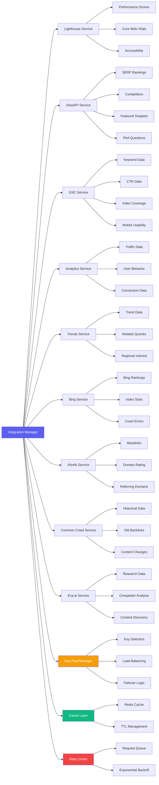

---

## 9. CONTENT OPPORTUNITY ENGINE

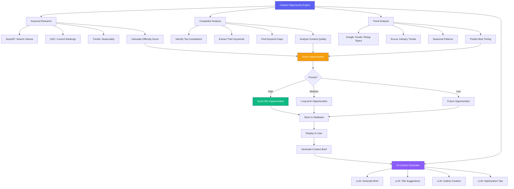

---

## 10. ANOMALY DETECTION SYSTEM

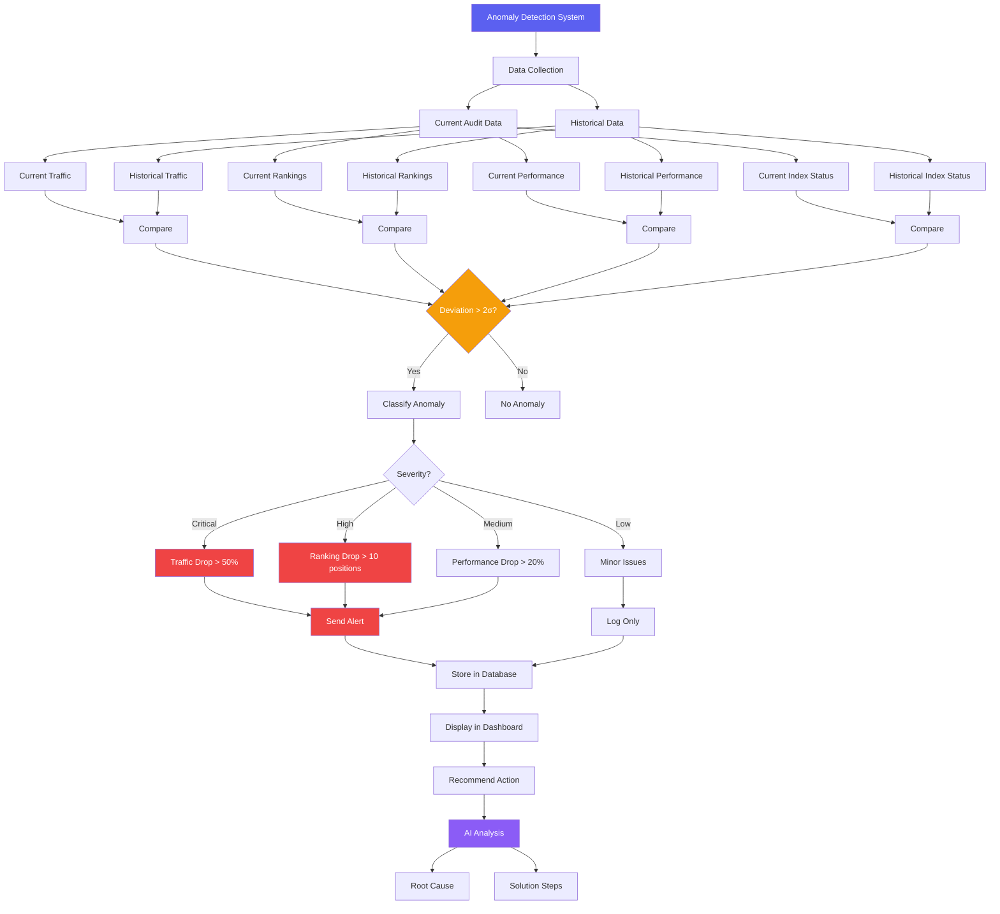

---

## 11. DEPLOYMENT ARCHITECTURE

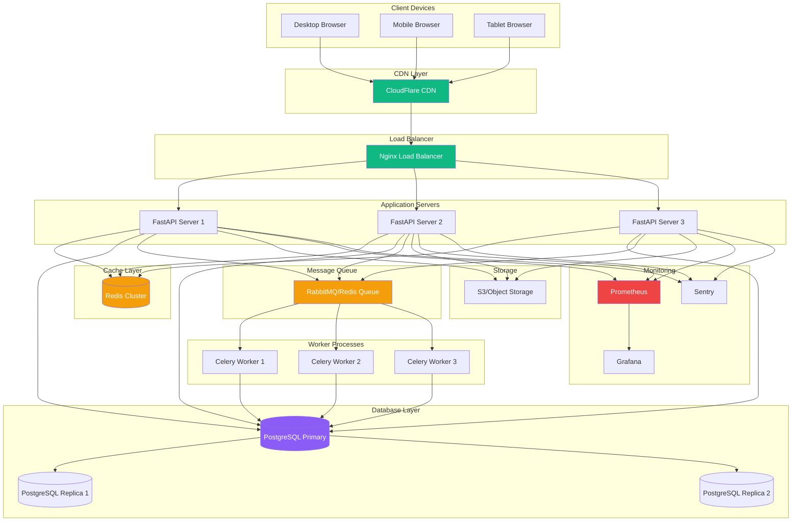

---

## 12. SECURITY ARCHITECTURE

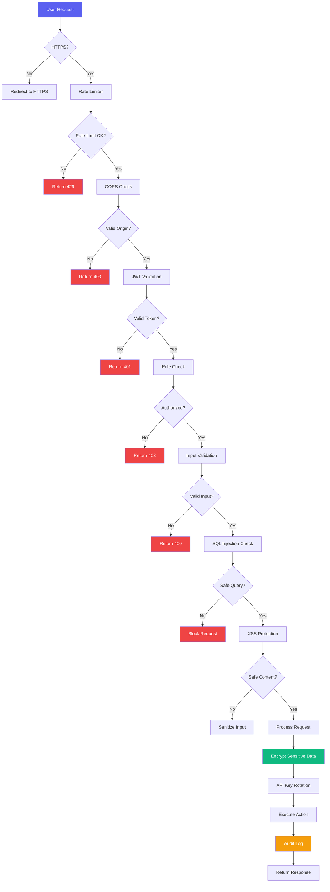

---

## 13. DATA FLOW - AUDIT CREATION TO REPORT

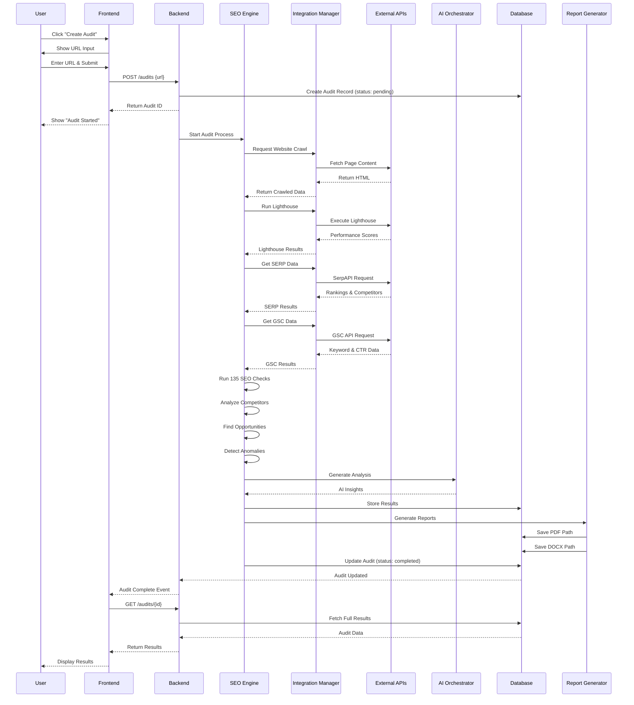

---

## 14. APOLLO.IO-INSPIRED UI MOCKUP STRUCTURE

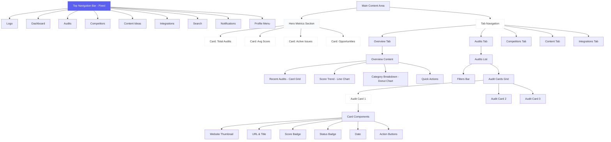

---

These diagrams provide a complete visual understanding of the system architecture, data flow, and UI structure. They show:

1. ✅ **System Architecture** - Overall technology stack
2. ✅ **Database Schema** - Complete data model with relationships
3. ✅ **API Integration Flow** - How external APIs are called with failover
4. ✅ **SEO Audit Flow** - Step-by-step audit processing
5. ✅ **User Journey** - User experience from registration to results
6. ✅ **Admin Panel** - Complete admin functionality
7. ✅ **Component Hierarchy** - Frontend component structure
8. ✅ **Integration Manager** - How 9 APIs are managed
9. ✅ **Content Opportunity Engine** - AI-powered content recommendations
10. ✅ **Anomaly Detection** - Automated issue detection
11. ✅ **Deployment Architecture** - Production infrastructure
12. ✅ **Security Architecture** - Security layers and validation
13. ✅ **Data Flow** - Complete audit creation flow
14. ✅ **UI Structure** - Apollo.io-inspired interface layout

Ready to start implementation! 🚀
